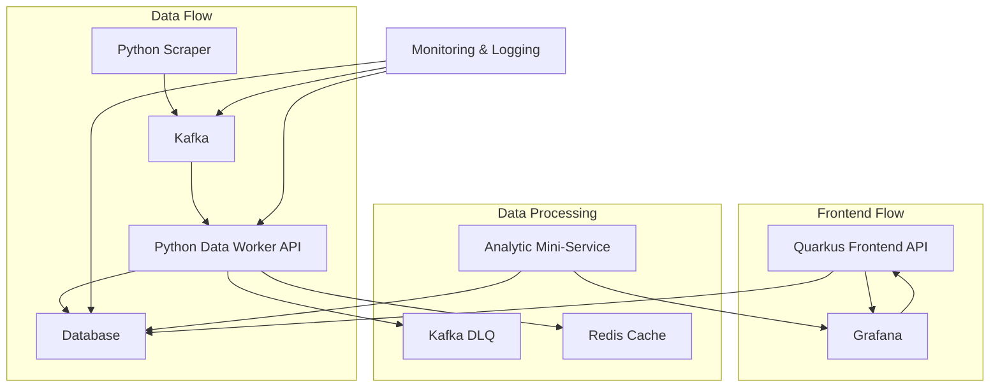

# CryptoViz — Visualisation Crypto 📈🔥

## Vue d'ensemble :
CryptoViz est un outil de visualisation pour les cryptomonnaies, offrant des analyses de marché en temps réel, basées sur des données précises et actualisées. 🤖⭐

## Fonctionnalités clés ⭐

- **Collecte de données 🗃** : Des scrapers Python collectent des données en temps réel ainsi qu'historiques sur les principales cryptomonnaies, garantissant une grande précision.
- **Traitement des données 🛠** : Kafka assure la diffusion et le traitement efficace des données en temps réel, permettant de gérer un trafic volumineux.
- **Stockage des données 💾** : PostgreSQL (PSQL) sert de base de données robuste, offrant scalabilité et sécurité pour toutes les données traitées.
- **Intégration API 🛠️** : L'API Quarkus permet une interaction rapide et légère avec la base de données, facilitant la communication entre le stockage et la couche de visualisation.
- **Visualisation des données 📈** : Grafana se connecte à l'API Quarkus pour fournir des tableaux de bord interactifs et riches en informations.

## Prérequis 🚀
Avant de commencer, assurez-vous d'avoir les éléments suivants installés sur votre système :
- **Docker** : Pour exécuter le flux de données et les services Grafana.
- **Java 17+** : Nécessaire pour l'API Quarkus.
- **Maven** : Pour construire et gérer les dépendances de l'API Quarkus.
- **Python** : Utilisé pour les scripts de collecte des données.

## Lancer les services de Flux de Données et Grafana 🛠️💡
Les services de flux de données et Grafana sont gérés via Docker Compose.

1. Accédez au répertoire contenant le fichier `docker-compose.yml` :
   ```bash
   cd data_flow
   ```

2. Exécutez la commande suivante pour démarrer les services :
   ```bash
   docker-compose up -d
   ```

3. Vérifiez que les services sont bien lancés :
   ```bash
   docker-compose ps
   ```

   **Services inclus** :
   - **Kafka** : Pour la diffusion des données.
   - **PostgreSQL** : Pour stocker les données des cryptomonnaies.
   - **Grafana** : Pour visualiser les données.

## Démarrer l'API Quarkus en mode développement 🚀
1. Accédez au répertoire de l'API Quarkus :
   ```bash
   cd back
   ```

2. Lancez l'API en mode développement :
   ```bash
   ./mvnw quarkus:dev
   ```
   > **Remarque** : Utilisez `mvn` si `mvnw` n'est pas disponible :
   > ```bash
   > mvn quarkus:dev
   > ```

3. L'API sera accessible à l'adresse :
   ```
   http://localhost:8080
   ```

## Flux de Données 🤖
Nous utilisons **Beautiful Soup**, une bibliothèque Python, pour scraper les informations spécifiques des cryptomonnaies depuis différents sites sources.
Chaque scraper a son propre fichier pour une meilleure organisation.

## Tables de la Base de Données (BDD) 📁

### Table `cryptocurrencies` 🏛
| **Champ**       | **Type**   | **Description**                                   |
|-----------------|------------|---------------------------------------------------|
| `id`            | `UUID`     | Identifiant unique de la cryptomonnaie.           |
| `name`          | `VARCHAR`  | Nom complet de la cryptomonnaie (ex : Bitcoin).   |
| `symbol`        | `VARCHAR`  | Symbole court (ex : BTC, ETH).                    |

### Table `currency_data` 💸
| **Champ**        | **Type**       | **Description**                                                |
|------------------|----------------|----------------------------------------------------------------|
| `currency_id`    | `UUID`         | Référence à l'ID de la table `cryptocurrencies`.               |
| `price`          | `DECIMAL`      | Prix actuel de la cryptomonnaie.                               |
| `market_cap`     | `DECIMAL`      | Capitalisation boursière actuelle.                            |
| `updated_at`     | `TIMESTAMP`    | Date et heure de la dernière mise à jour.                     |
| `source`         | `VARCHAR`      | Source des données (ex : site web ou API).                    |
| `trust_factor`   | `INTEGER`      | Indicateur de confiance des données (sur une échelle arbitraire). |

### Table `crypto_data_history` 📑
| **Champ**        | **Type**       | **Description**                                                |
|------------------|----------------|----------------------------------------------------------------|
| `id`             | `UUID`         | Identifiant unique pour chaque enregistrement historique.      |
| `currency_id`    | `UUID`         | Référence à l'ID de la table `cryptocurrencies`.               |
| `price`          | `DECIMAL`      | Prix de la cryptomonnaie à ce moment précis.                   |
| `market_cap`     | `DECIMAL`      | Capitalisation boursière à ce moment précis.                   |
| `timestamp`      | `TIMESTAMP`    | Horodatage des données historiques collectées.                 |
| `source`         | `VARCHAR`      | Source des données historiques (ex : site web ou API).        |
| `trust_factor`   | `INTEGER`      | Indicateur de confiance des données historiques.               |
| `created_at`     | `TIMESTAMP`    | Date et heure d'enregistrement dans la base de données.        |

## API Quarkus 🏠
### Documentation des Endpoints
| **Endpoint**                       | **Méthode** | **Description**                                                                 | **Paramètres**                     | **Exemple de Réponse**                                     |
|------------------------------------|-------------|---------------------------------------------------------------------------------|------------------------------------|-----------------------------------------------------------|
| **`/currencies`**                  | `GET`       | Récupère la liste de toutes les cryptomonnaies disponibles.                     | Aucune                             | `[{"id": "uuid", "name": "Bitcoin", "symbol": "BTC"}]`     |
| **`/currencies/current`**          | `GET`       | Récupère les données actuelles (prix et market cap) de toutes les cryptomonnaies.| Aucune                             | `[{"id": "uuid", "price": "40000", "market_cap": "800B"}]`|
| **`/{currencyName}/history`**      | `GET`       | Récupère les données historiques d'une cryptomonnaie donnée.                    | `currencyName` : Nom de la monnaie | `[{"timestamp": "2024-01-01", "price": "30000"}]`         |
| **`/{currencyName}/current`**      | `GET`       | Récupère les données actuelles d'une cryptomonnaie donnée.                      | `currencyName` : Nom de la monnaie | `{ "id": "uuid", "price": "40000", "market_cap": "800B"}`  |

## Exemples de Réponses 📄
### 1. Liste des cryptomonnaies (`GET /currencies`)
```json
[
    {"id": "uuid1", "name": "Bitcoin", "symbol": "BTC", "price": "40000", "market_cap": "800B"},
    {"id": "uuid2", "name": "Ethereum", "symbol": "ETH", "price": "3000", "market_cap": "500B"}
]
```
### 2. Données actuelles de toutes les cryptomonnaies (`GET /currencies/current`)
```json
[
    {"id": "uuid1", "name": "Bitcoin", "symbol": "BTC", "price": "40000", "market_cap": "800B"},
    {"id": "uuid2", "name": "Ethereum", "symbol": "ETH", "price": "3000", "market_cap": "500B"}
]
```
### 3. Données historiques pour une cryptomonnaie (`GET /bitcoin/history`)
```json
[
    { "id": "uuid1", "name": "Bitcoin","timestamp": "2024-01-01T12:00:00Z", "price": "30000", "market_cap": "600B"},
    { "id": "uuid2","name": "Ethereum","timestamp": "2024-01-02T12:00:00Z", "price": "32000", "market_cap": "640B"}
]
```
### 4. Données actuelles pour une cryptomonnaie (`GET /bitcoin/current`)
```json
{
    "id": "uuid1",
    "price": "40000",
    "market_cap": "800B",
    "source": "example.com",
    "trust_factor": 9
}
```

## Grafana : Visualisation des Données 📈🎨
- **Liste des Cryptomonnaies 🏛**
 - **Time Series⌛**: Évolution du prix des cryptos
 - **Bar chart**  📊 : Comparaison des prix des cryptos du top 10
- **Prix et Capitalisation du Bitcoin** 💰
- **Prix et Capitalisation de l'Ethereum** 👩‍💸
- **Jauge de Trust Factor** : Confiance pour BTC, ETH, etc.

   ## Diagramme Architecture


Et voilà ! Vous avez maintenant une meilleure vision de CryptoViz 📈🔥 ! Si vous avez des questions ou avez besoin de plus de détails, n'hésitez pas à demander. Bonne exploration crypto 🌐 !

